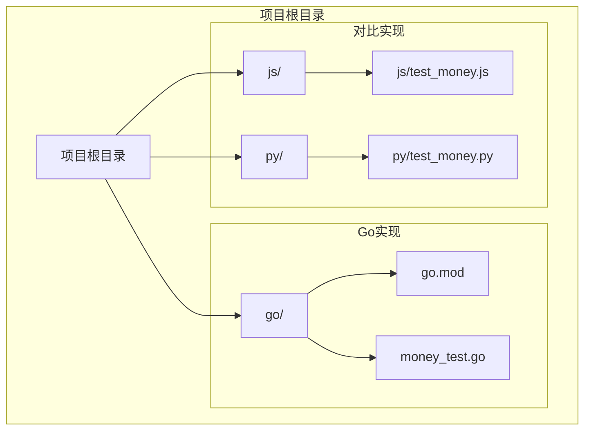
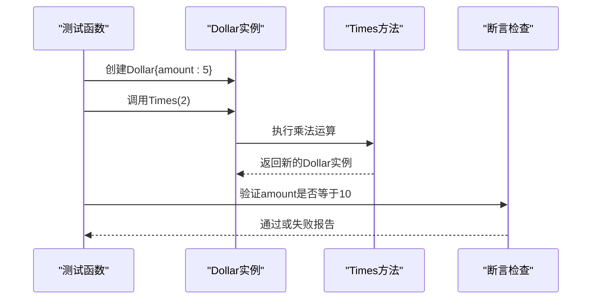
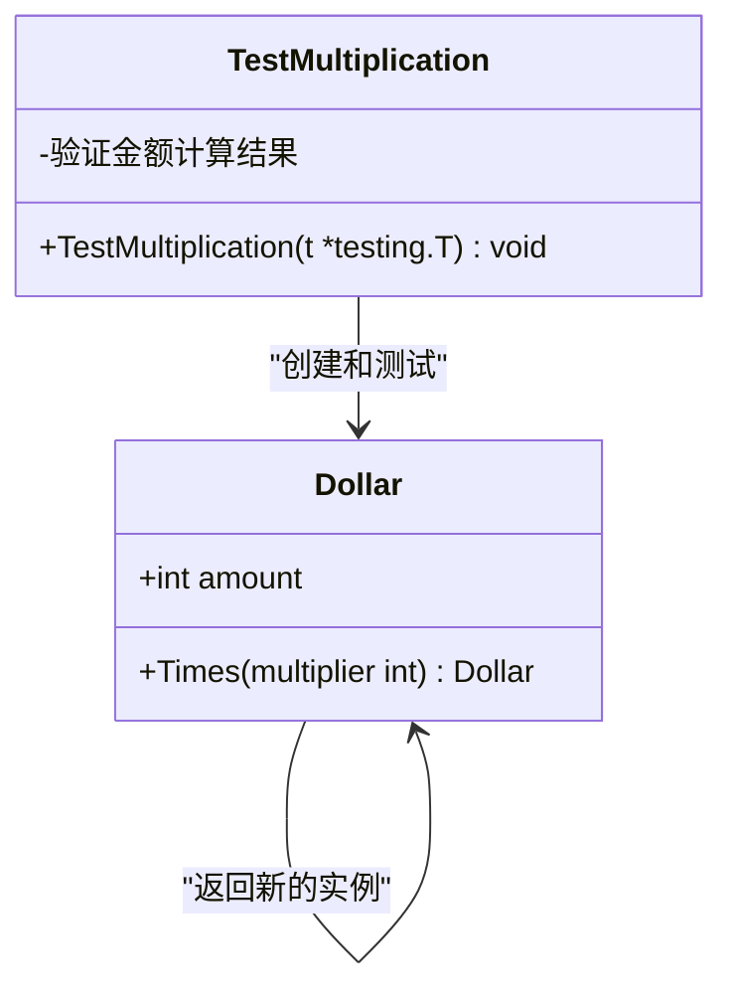
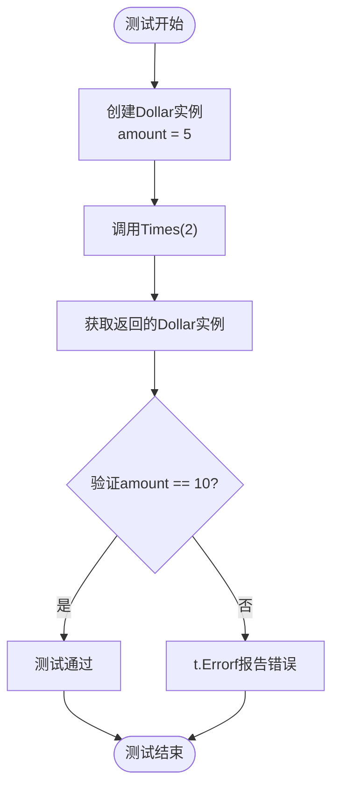
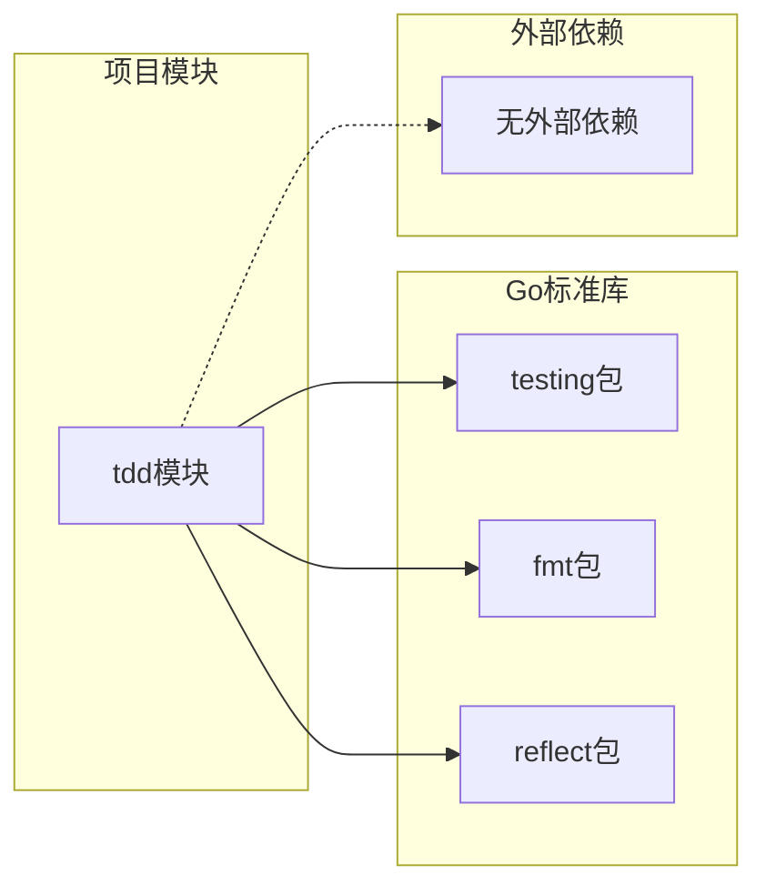

# Go语言实现

<cite>
**本文档引用的文件**
- [go.mod](file://go/go.mod)
- [money_test.go](file://go/money_test.go)
- [test_money.js](file://js/test_money.js)
- [test_money.py](file://py/test_money.py)
</cite>

## 目录
1. [简介](#简介)
2. [项目结构](#项目结构)
3. [核心组件](#核心组件)
4. [架构概览](#架构概览)
5. [详细组件分析](#详细组件分析)
6. [依赖关系分析](#依赖关系分析)
7. [性能考虑](#性能考虑)
8. [故障排除指南](#故障排除指南)
9. [结论](#结论)

## 简介

本项目是一个基于测试驱动开发(TDD)的Go语言实现，展示了如何使用Go标准库testing包编写单元测试。该项目通过对比JavaScript和Python的实现方式，突出了Go语言在类型安全、编译时检查和并发支持方面的优势。

项目的核心目标是实现一个Dollar类，该类具有amount字段和Times方法，用于演示Go语言的测试驱动开发流程。

## 项目结构

项目采用简洁的分层组织结构，专注于Go语言测试实现：

**图表来源**
- [go.mod:1-4](file://go/go.mod#L1-L4)
- [money_test.go:1-14](file://go/money_test.go#L1-L14)

**章节来源**
- [go.mod:1-4](file://go/go.mod#L1-L4)
- [money_test.go:1-14](file://go/money_test.go#L1-L14)

## 核心组件

### Go模块系统配置

Go模块系统提供了现代化的依赖管理和版本控制机制：

- **模块声明**: 使用`module tdd`声明项目模块名
- **Go版本**: 指定Go 1.25.6版本，确保兼容性和新特性支持
- **工作区管理**: 支持多模块工作区，便于大型项目的组织

### 测试框架集成

项目使用Go标准库testing包进行单元测试：

- **测试函数命名**: 必须以`Test`开头，后跟描述性名称
- **参数约定**: 测试函数接收`*testing.T`类型的参数
- **断言机制**: 使用`t.Errorf`进行失败报告和错误信息输出

**章节来源**
- [go.mod:1-4](file://go/go.mod#L1-L4)
- [money_test.go:1-14](file://go/money_test.go#L1-L14)

## 架构概览

整个系统围绕Dollar类的实现展开，采用测试驱动开发模式：

**图表来源**
- [money_test.go:6-14](file://go/money_test.go#L6-L14)

## 详细组件分析

### Dollar类设计

虽然Dollar类的完整实现未在当前代码库中显示，但从测试代码可以推断其基本结构：

**图表来源**
- [money_test.go:6-14](file://go/money_test.go#L6-L14)

### 测试函数实现

测试函数遵循Go语言的严格命名约定和测试模式：

#### 测试函数结构分析

**图表来源**
- [money_test.go:6-14](file://go/money_test.go#L6-L14)

#### 断言方法详解

Go语言的断言机制具有以下特点：

- **错误报告**: 使用`t.Errorf`格式化错误消息
- **条件检查**: 通过if语句实现条件判断
- **测试失败**: 自动标记测试为失败状态

**章节来源**
- [money_test.go:6-14](file://go/money_test.go#L6-L14)

### 与对比语言的差异

#### JavaScript实现对比

| 特性 | Go实现 | JavaScript实现 |
|------|--------|----------------|
| 类型系统 | 强类型，编译时检查 | 动态类型，运行时检查 |
| 对象创建 | 结构体字面量 | 构造函数调用 |
| 方法调用 | 实例方法调用 | 实例方法调用 |
| 断言机制 | t.Errorf错误报告 | assert.strictEqual |

#### Python实现对比

| 特性 | Go实现 | Python实现 |
|------|--------|------------|
| 测试框架 | testing包 | unittest框架 |
| 断言方法 | t.Errorf | self.assertEqual |
| 测试执行 | go test命令 | unittest.main() |
| 类型安全 | 编译时检查 | 运行时检查 |

**章节来源**
- [test_money.js:1-6](file://js/test_money.js#L1-L6)
- [test_money.py:1-11](file://py/test_money.py#L1-L11)

## 依赖关系分析

### Go模块依赖图

**图表来源**
- [go.mod:1-4](file://go/go.mod#L1-L4)
- [money_test.go:2-4](file://go/money_test.go#L2-L4)

### 模块间关系

Go模块系统提供了清晰的依赖管理：

- **内部依赖**: 测试文件直接依赖testing包
- **版本管理**: 明确指定Go版本要求
- **模块解析**: 自动处理包导入和依赖解析

**章节来源**
- [go.mod:1-4](file://go/go.mod#L1-L4)

## 性能考虑

### Go语言性能优势

1. **编译时优化**: Go编译器进行静态分析和优化
2. **内存管理**: 垃圾回收器减少内存泄漏风险
3. **并发支持**: goroutine和channel提供高效并发模型
4. **类型安全**: 编译时类型检查避免运行时错误

### 测试性能最佳实践

- **测试隔离**: 每个测试独立运行，互不干扰
- **基准测试**: 使用`go test -bench`进行性能基准测试
- **内存使用**: 避免在测试中创建不必要的大对象

## 故障排除指南

### 常见问题及解决方案

#### 测试函数命名错误

**问题**: 测试函数名不符合Go命名约定
**解决方案**: 确保函数名以`Test`开头，如`TestMultiplication`

#### 导入包路径错误

**问题**: testing包导入路径不正确
**解决方案**: 使用标准导入路径`"testing"`

#### 断言失败处理

**问题**: 测试失败时没有适当的错误报告
**解决方案**: 使用`t.Errorf`提供详细的错误信息

#### 金额比较错误

**问题**: 金额值比较逻辑错误
**解决方案**: 确保Times方法正确实现乘法运算

### 调试技巧

1. **使用`-v`标志**: `go test -v`显示详细测试输出
2. **添加日志**: 在测试中使用`t.Log`输出调试信息
3. **分步调试**: 将复杂测试分解为多个简单的子测试

**章节来源**
- [money_test.go:6-14](file://go/money_test.go#L6-L14)

## 结论

本Go语言实现展示了现代Go开发的最佳实践，包括：

- **严格的类型系统**: 通过编译时检查确保代码质量
- **简洁的测试框架**: 使用Go标准库testing包进行单元测试
- **清晰的依赖管理**: 通过Go模块系统管理项目依赖
- **高效的并发支持**: 利用goroutine和channel构建高性能应用

该项目为学习Go语言测试驱动开发提供了良好的起点，同时通过与JavaScript和Python实现的对比，突出了Go语言在工程实践中的独特优势。