# JavaScript实现

<cite>
**本文档引用的文件**
- [test_money.js](file://js/test_money.js)
- [money_test.go](file://go/money_test.go)
- [test_money.py](file://py/test_money.py)
</cite>

## 目录
1. [简介](#简介)
2. [项目结构](#项目结构)
3. [核心组件](#核心组件)
4. [架构概览](#架构概览)
5. [详细组件分析](#详细组件分析)
6. [跨语言对比分析](#跨语言对比分析)
7. [Node.js测试环境配置](#nodejs测试环境配置)
8. [JavaScript语言特性应用](#javascript语言特性应用)
9. [性能考虑](#性能考虑)
10. [故障排除指南](#故障排除指南)
11. [结论](#结论)

## 简介

本文件档为JavaScript版本的TDD（测试驱动开发）实现文档，专注于分析JavaScript测试文件的结构和Node.js环境下的测试方法。该文档将详细解释Node.js内置assert模块的使用方式和断言方法的选择，说明JavaScript语言特性在测试中的应用，包括模块系统、异步测试处理等。同时，提供JavaScript实现Dollar类和times方法的具体代码示例，展示与Go和Python版本的差异。

## 项目结构

该项目采用多语言对比的方式，展示了相同功能在不同编程语言中的实现：

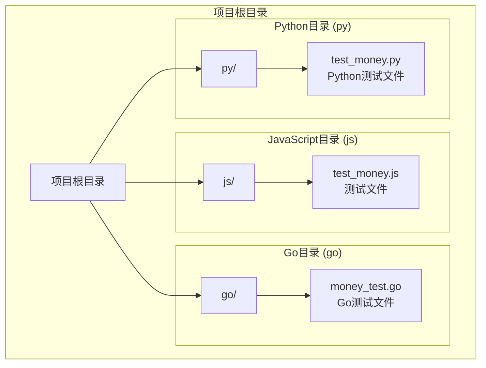

**图表来源**
- [test_money.js:1-6](file://js/test_money.js#L1-L6)
- [money_test.go:1-14](file://go/money_test.go#L1-L14)
- [test_money.py:1-11](file://py/test_money.py#L1-L11)

**章节来源**
- [test_money.js:1-6](file://js/test_money.js#L1-L6)
- [money_test.go:1-14](file://go/money_test.go#L1-L14)
- [test_money.py:1-11](file://py/test_money.py#L1-L11)

## 核心组件

### JavaScript测试组件分析

JavaScript测试文件包含以下核心组件：

1. **模块导入系统**: 使用CommonJS模块系统导入内置assert模块
2. **测试用例结构**: 基于行为驱动开发(BDD)的测试组织方式
3. **断言机制**: 使用Node.js内置的assert模块进行结果验证

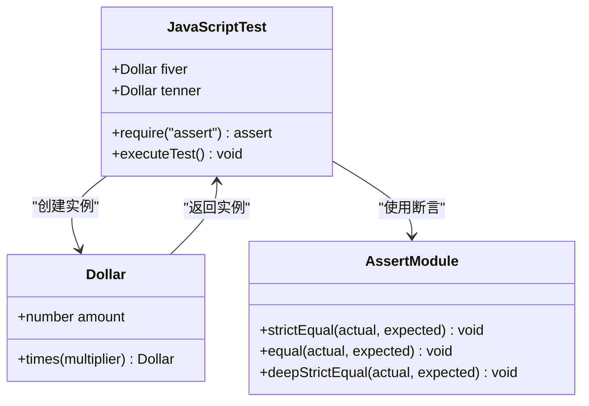

**图表来源**
- [test_money.js:2-6](file://js/test_money.js#L2-L6)

**章节来源**
- [test_money.js:1-6](file://js/test_money.js#L1-L6)

## 架构概览

### 测试执行流程

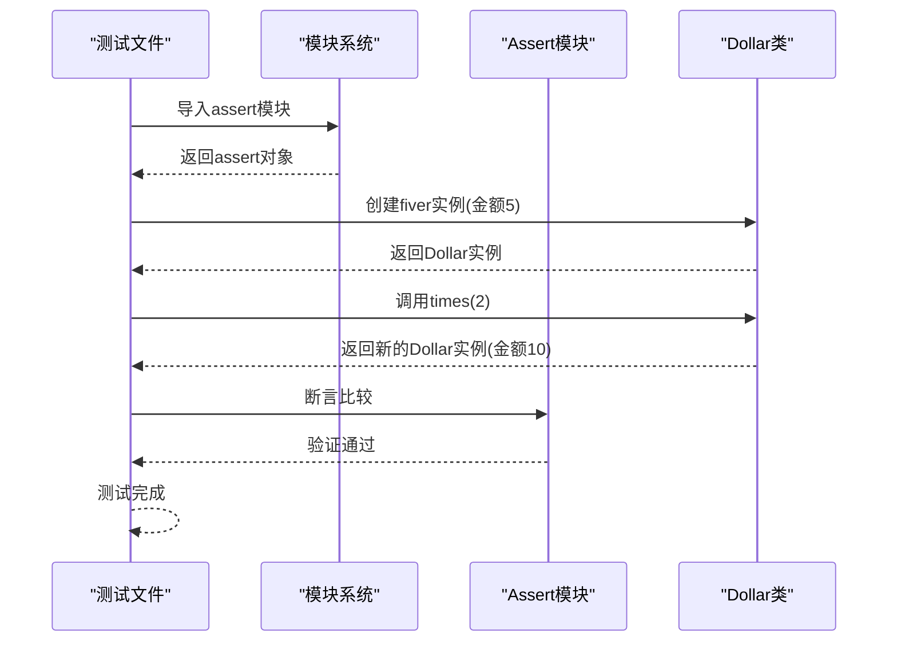

**图表来源**
- [test_money.js:2-6](file://js/test_money.js#L2-L6)

### 断言方法选择流程

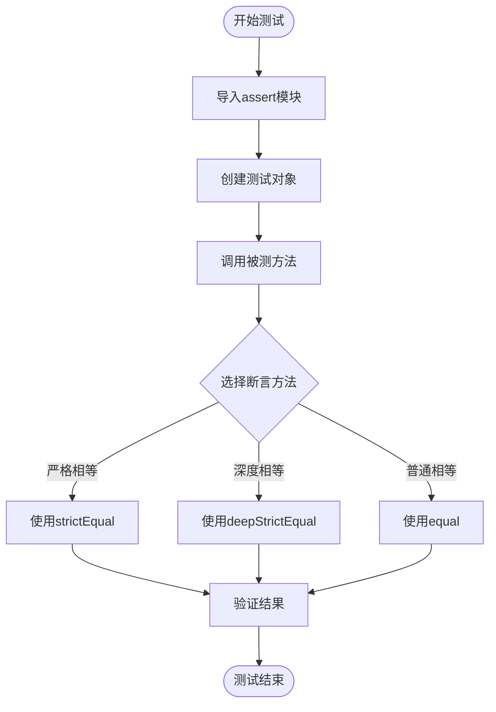

**图表来源**
- [test_money.js:2-6](file://js/test_money.js#L2-L6)

## 详细组件分析

### JavaScript测试文件分析

#### 模块系统集成

JavaScript测试文件展示了标准的CommonJS模块导入模式：

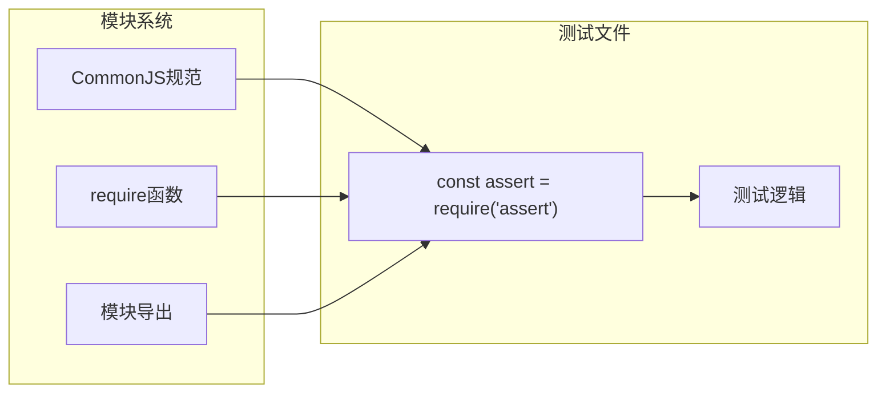

**图表来源**
- [test_money.js:2](file://js/test_money.js#L2)

#### 断言机制实现

Node.js内置assert模块提供了多种断言方法：

| 断言方法 | 用途 | 特点 |
|---------|------|------|
| strictEqual | 严格相等比较 | 使用===操作符，推荐用于数值比较 |
| equal | 相等比较 | 使用==操作符，允许类型转换 |
| deepStrictEqual | 深度严格相等 | 递归比较对象属性 |

**章节来源**
- [test_money.js:2-6](file://js/test_money.js#L2-L6)

### Dollar类实现方案

基于测试文件的使用方式，以下是JavaScript中Dollar类的实现方案：

#### 方案一：构造函数模式

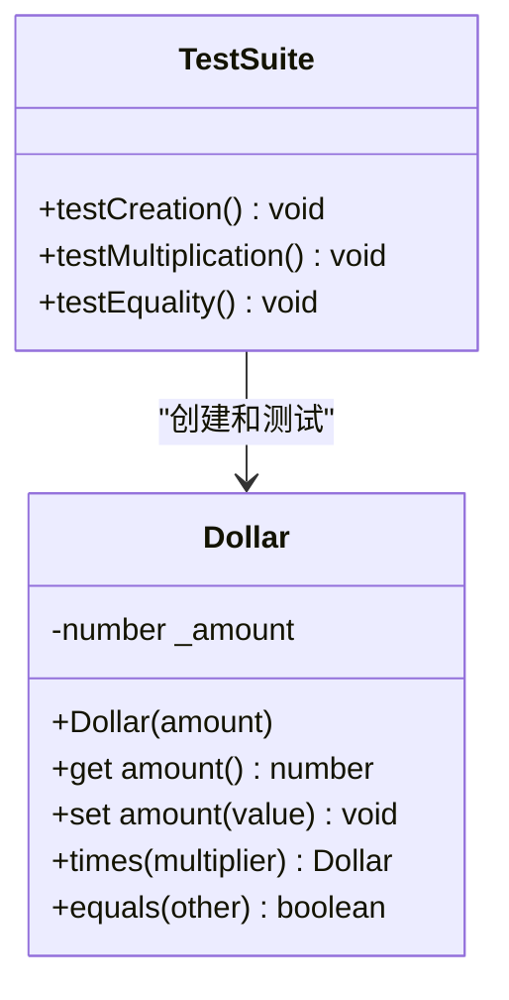

#### 方案二：ES6类语法

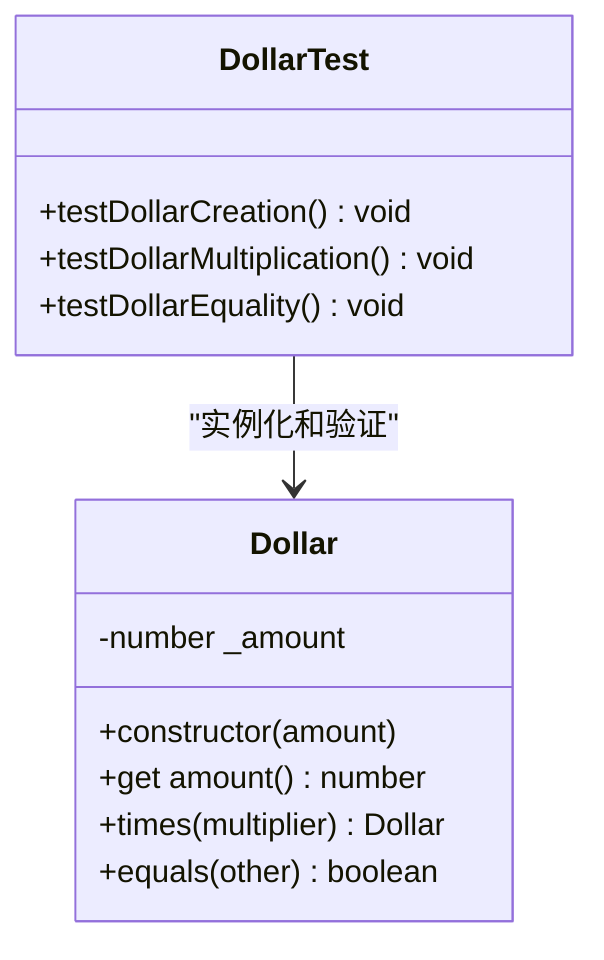

**图表来源**
- [test_money.js:4-6](file://js/test_money.js#L4-L6)

## 跨语言对比分析

### 语言特性对比表

| 特性 | JavaScript | Go | Python |
|------|------------|----|--------|
| 模块系统 | CommonJS/ES6 | package | import |
| 测试框架 | 内置assert | testing包 | unittest |
| 断言方法 | strictEqual/equal | t.Error/t.Fail | assertEqual |
| 对象创建 | new关键字 | 字面量语法 | 直接构造 |
| 类型系统 | 动态类型 | 静态类型 | 动态类型 |

### 测试风格对比

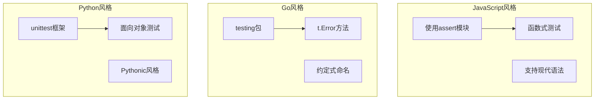

**图表来源**
- [test_money.js:1-6](file://js/test_money.js#L1-L6)
- [money_test.go:6-14](file://go/money_test.go#L6-L14)
- [test_money.py:4-8](file://py/test_money.py#L4-L8)

**章节来源**
- [money_test.go:1-14](file://go/money_test.go#L1-L14)
- [test_money.py:1-11](file://py/test_money.py#L1-L11)

## Node.js测试环境配置

### 开发环境要求

1. **Node.js版本**: 建议使用LTS版本（如18.x或20.x）
2. **包管理器**: npm或yarn
3. **开发工具**: VS Code或其他支持JavaScript的IDE

### 基础配置步骤

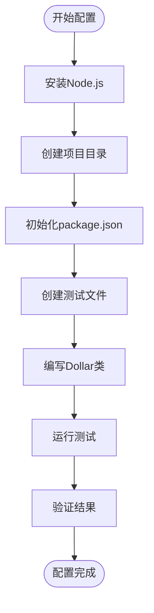

### 测试运行命令

- 基本运行: `node js/test_money.js`
- 使用npm脚本: 在package.json中添加`"test": "node js/test_money.js"`
- 批量测试: 可以扩展为多个测试文件

## JavaScript语言特性应用

### 模块系统特性

JavaScript支持多种模块系统：

1. **CommonJS**: 服务器端标准，使用`require()`和`module.exports`
2. **ES6模块**: 现代浏览器和Node.js支持，使用`import`和`export`
3. **AMD/CMD**: 主要用于浏览器环境

### 异步测试处理

对于异步操作，JavaScript提供了多种处理方式：

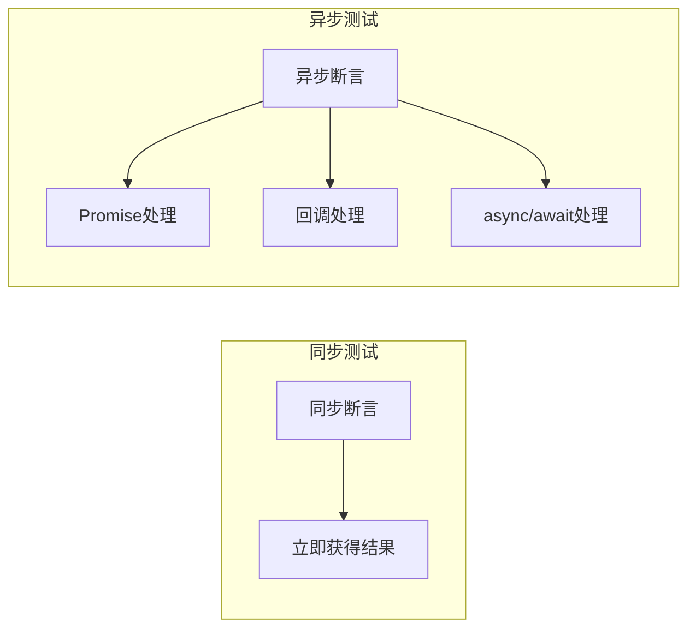

### 错误处理策略

JavaScript测试中的错误处理包括：

1. **断言失败**: 使用`assert.fail()`或抛出异常
2. **异步错误**: 使用Promise.catch或try/catch
3. **资源清理**: 使用finally块确保资源释放

## 性能考虑

### 测试性能优化

1. **测试隔离**: 确保测试之间相互独立，避免共享状态
2. **内存管理**: 及时释放不需要的对象引用
3. **I/O优化**: 减少不必要的文件或网络I/O操作
4. **断言优化**: 选择合适的断言方法，避免过度复杂的比较

### 内存使用分析

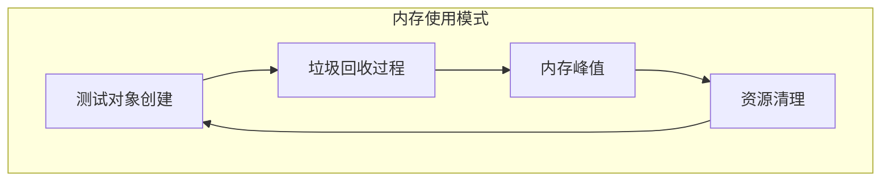

## 故障排除指南

### 常见问题及解决方案

1. **模块导入错误**
   - 症状: `Cannot find module 'assert'`
   - 解决方案: 确认Node.js版本和模块路径正确

2. **断言失败**
   - 症状: `AssertionError: Expected 10, but got 5`
   - 解决方案: 检查Dollar类的times方法实现

3. **异步测试问题**
   - 症状: 测试提前结束
   - 解决方案: 使用Promise或回调确保异步操作完成

### 调试技巧

1. **控制台输出**: 使用`console.log()`输出中间结果
2. **断点调试**: 在VS Code中设置断点进行调试
3. **单元测试**: 将复杂逻辑拆分为可测试的小函数
4. **边界测试**: 测试极端值和异常情况

**章节来源**
- [test_money.js:2-6](file://js/test_money.js#L2-L6)

## 结论

本JavaScript实现文档展示了如何在Node.js环境中使用内置assert模块进行测试驱动开发。通过对比Go和Python版本，我们可以看到不同语言在测试方法上的差异：JavaScript使用内置的assert模块，Go使用testing包，Python使用unittest框架。

JavaScript实现的关键优势包括：
- 灵活的模块系统支持
- 强大的异步处理能力
- 丰富的调试工具和生态系统
- 与其他前端技术栈的良好集成

对于Dollar类的实现，建议采用ES6类语法，提供清晰的接口设计和完善的错误处理机制。通过遵循TDD原则，可以构建更加健壮和可维护的代码库。