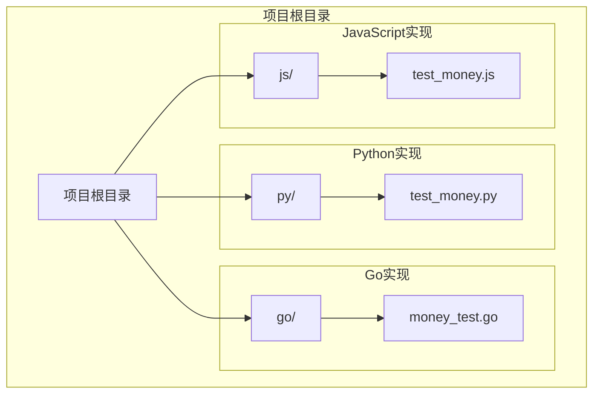
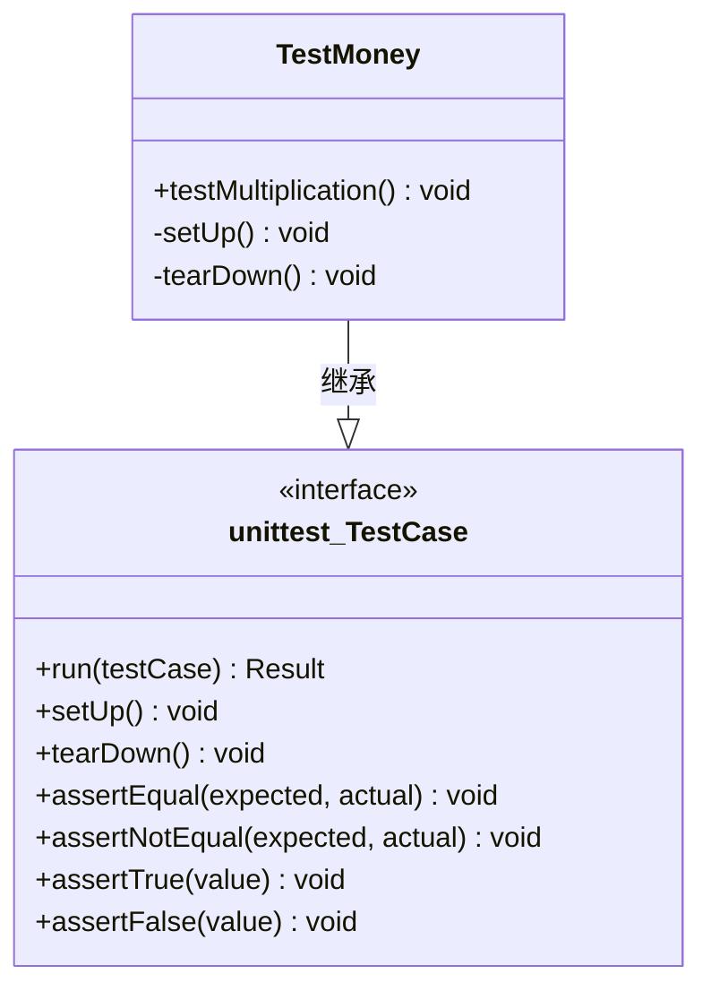
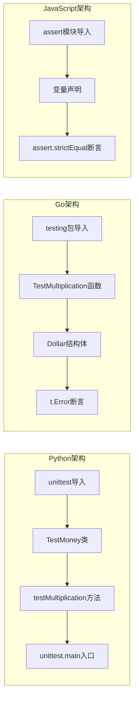
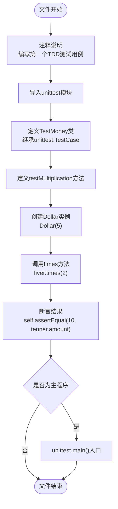
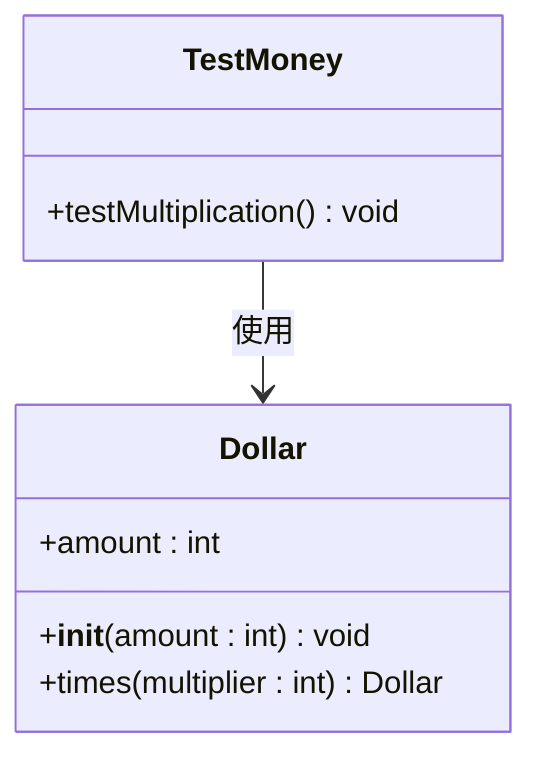
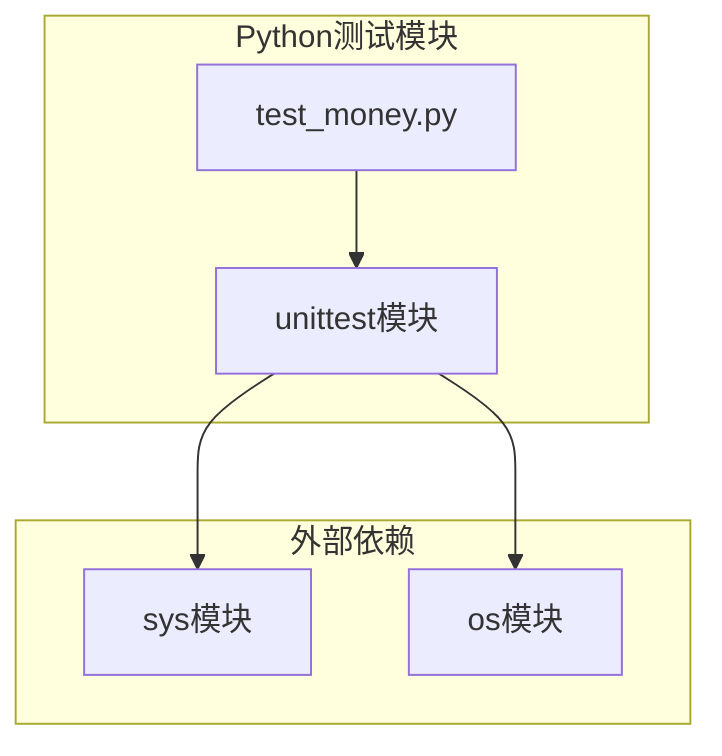
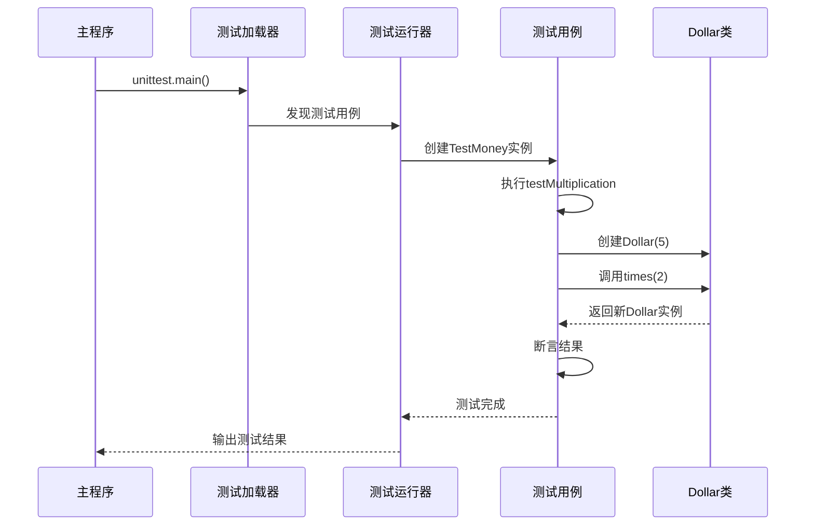

# Python实现

<cite>
**本文档引用的文件**
- [test_money.py](file://py/test_money.py)
- [money_test.go](file://go/money_test.go)
- [test_money.js](file://js/test_money.js)
</cite>

## 目录
1. [简介](#简介)
2. [项目结构](#项目结构)
3. [核心组件](#核心组件)
4. [架构概览](#架构概览)
5. [详细组件分析](#详细组件分析)
6. [依赖关系分析](#依赖关系分析)
7. [性能考虑](#性能考虑)
8. [故障排除指南](#故障排除指南)
9. [结论](#结论)

## 简介

本项目是一个跨语言的测试驱动开发(TDD)练习，展示了如何在不同编程语言中实现相同的业务逻辑。该项目包含了Python、Go和JavaScript三种语言的实现，重点演示了unittest框架的使用和Dollar类的测试驱动开发过程。

Python版本的实现展示了现代Python测试的最佳实践，包括：
- 使用unittest.TestCase基类构建测试用例
- 遵循Python命名约定和编码规范
- 实现简洁有效的测试方法组织方式
- 展示如何运行和调试Python测试

## 项目结构

该项目采用按语言分组的目录结构，便于比较不同语言的实现方式：



**图表来源**
- [test_money.py:1-11](file://py/test_money.py#L1-L11)
- [money_test.go:1-18](file://go/money_test.go#L1-L18)
- [test_money.js:1-6](file://js/test_money.js#L1-L6)

**章节来源**
- [test_money.py:1-11](file://py/test_money.py#L1-L11)
- [money_test.go:1-18](file://go/money_test.go#L1-L18)
- [test_money.js:1-6](file://js/test_money.js#L1-L6)

## 核心组件

### 测试框架基础

Python测试的核心是unittest模块，它提供了完整的测试框架功能：

- **unittest.TestCase基类**：所有测试类必须继承自此基类
- **测试方法命名约定**：以`test`开头的方法会被自动识别为测试用例
- **断言方法**：提供丰富的断言工具验证测试结果
- **测试发现机制**：支持自动发现和执行测试用例

### 测试用例结构



**图表来源**
- [test_money.py:4-8](file://py/test_money.py#L4-L8)

**章节来源**
- [test_money.py:2-11](file://py/test_money.py#L2-L11)

## 架构概览

### 跨语言测试架构对比

该项目展示了三种不同语言的测试架构模式：



**图表来源**
- [test_money.py:1-11](file://py/test_money.py#L1-L11)
- [money_test.go:1-18](file://go/money_test.go#L1-L18)
- [test_money.js:1-6](file://js/test_money.js#L1-L6)

## 详细组件分析

### Python测试文件分析

#### 文件结构和导入

Python测试文件采用了简洁而标准的结构：



**图表来源**
- [test_money.py:1-11](file://py/test_money.py#L1-L11)

#### 测试方法实现细节

测试方法遵循了unittest框架的标准模式：

1. **方法命名**：使用`test`前缀，符合Python命名约定
2. **测试逻辑**：创建对象、执行操作、验证结果
3. **断言使用**：使用`assertEqual`进行值比较
4. **测试组织**：每个测试方法专注于单一功能验证

**章节来源**
- [test_money.py:4-8](file://py/test_money.py#L4-L8)

### Dollar类实现需求分析

从测试文件可以看出，需要实现一个Dollar类来支持以下功能：



**图表来源**
- [test_money.py:6-7](file://py/test_money.py#L6-L7)

虽然当前测试文件中未包含Dollar类的具体实现，但从测试逻辑可以推断出其基本要求：
- 接受amount参数的构造函数
- times方法返回新的Dollar实例
- amount属性存储数值信息

**章节来源**
- [test_money.py:6-7](file://py/test_money.py#L6-L7)

### 跨语言实现对比

#### Python vs Go vs JavaScript

| 特性 | Python | Go | JavaScript |
|------|--------|----|------------|
| 导入方式 | `import unittest` | `import testing` | `const assert = require('assert')` |
| 测试类 | `unittest.TestCase` | `t *testing.T` | 直接函数 |
| 断言方法 | `self.assertEqual()` | `t.Errorf()` | `assert.strictEqual()` |
| 类型系统 | 动态类型 | 静态类型 | 动态类型 |
| 对象创建 | `Dollar(5)` | `Dollar{amount: 5}` | `new Dollar(5)` |

**图表来源**
- [test_money.py:2](file://py/test_money.py#L2)
- [money_test.go:2-4](file://go/money_test.go#L2-L4)
- [test_money.js:2](file://js/test_money.js#L2)

**章节来源**
- [test_money.py:1-11](file://py/test_money.py#L1-L11)
- [money_test.go:1-18](file://go/money_test.go#L1-L18)
- [test_money.js:1-6](file://js/test_money.js#L1-L6)

## 依赖关系分析

### 模块依赖图



**图表来源**
- [test_money.py:2](file://py/test_money.py#L2)

### 测试执行流程



**图表来源**
- [test_money.py:10-11](file://py/test_money.py#L10-L11)

**章节来源**
- [test_money.py:10-11](file://py/test_money.py#L10-L11)

## 性能考虑

### Python测试性能优化建议

1. **测试隔离**：确保测试之间相互独立，避免共享状态
2. **资源管理**：合理管理测试中使用的外部资源
3. **断言效率**：使用适当的断言方法，避免不必要的计算
4. **测试数据**：使用简单有效的测试数据，减少测试时间

### 内存使用优化

- 避免在测试中创建过大的对象
- 及时清理不需要的测试变量
- 使用生成器表达式处理大量数据

## 故障排除指南

### 常见问题和解决方案

#### 1. Dollar类未定义错误

**问题描述**：运行测试时出现NameError，提示Dollar未定义

**解决方案**：
```python
# 需要先实现Dollar类
class Dollar:
    def __init__(self, amount):
        self.amount = amount
    
    def times(self, multiplier):
        return Dollar(self.amount * multiplier)
```

#### 2. 测试无法发现

**问题描述**：unittest无法找到测试用例

**解决方案**：
- 确保测试类继承自unittest.TestCase
- 测试方法名称必须以test开头
- 确保文件名以test_开头或包含_test

#### 3. 断言失败

**问题描述**：测试断言失败，结果不符合预期

**排查步骤**：
1. 检查Dollar类的times方法实现
2. 验证amount属性的正确性
3. 确认乘法运算的逻辑

**章节来源**
- [test_money.py:4-8](file://py/test_money.py#L4-L8)

### 调试技巧

#### 1. 使用unittest的调试选项

```bash
# 运行单个测试
python -m unittest py.test_money.TestMoney.testMultiplication

# 详细输出
python -m unittest -v py.test_money.TestMoney.testMultiplication

# 显示所有测试
python -m unittest discover -s py -p "test_*.py"
```

#### 2. 添加调试信息

```python
import unittest
import sys

class TestMoney(unittest.TestCase):
    def testMultiplication(self):
        print(f"Debug: Creating Dollar(5)")
        fiver = Dollar(5)
        print(f"Debug: fiver.amount = {fiver.amount}")
        tenner = fiver.times(2)
        print(f"Debug: tenner.amount = {tenner.amount}")
        self.assertEqual(10, tenner.amount)
```

#### 3. 使用Python内置调试器

```python
import pdb

class TestMoney(unittest.TestCase):
    def testMultiplication(self):
        pdb.set_trace()  # 设置断点
        fiver = Dollar(5)
        tenner = fiver.times(2)
        self.assertEqual(10, tenner.amount)
```

## 结论

本Python实现展示了现代Python测试驱动开发的最佳实践。通过unittest框架，开发者可以：

1. **建立清晰的测试结构**：使用TestCase基类和标准命名约定
2. **实现简洁的测试逻辑**：专注于单一功能验证
3. **利用丰富的断言工具**：确保测试结果的准确性
4. **支持自动化测试执行**：通过unittest.main()实现测试自动化

虽然当前的测试文件引用了尚未实现的Dollar类，但测试逻辑清晰地表明了所需的功能特性。通过TDD方法，开发者可以逐步实现这些功能，确保代码质量和可维护性。

对于Python开发者而言，这个项目提供了一个很好的学习案例，展示了如何在实际项目中应用unittest框架，以及如何设计清晰、可维护的测试代码结构。