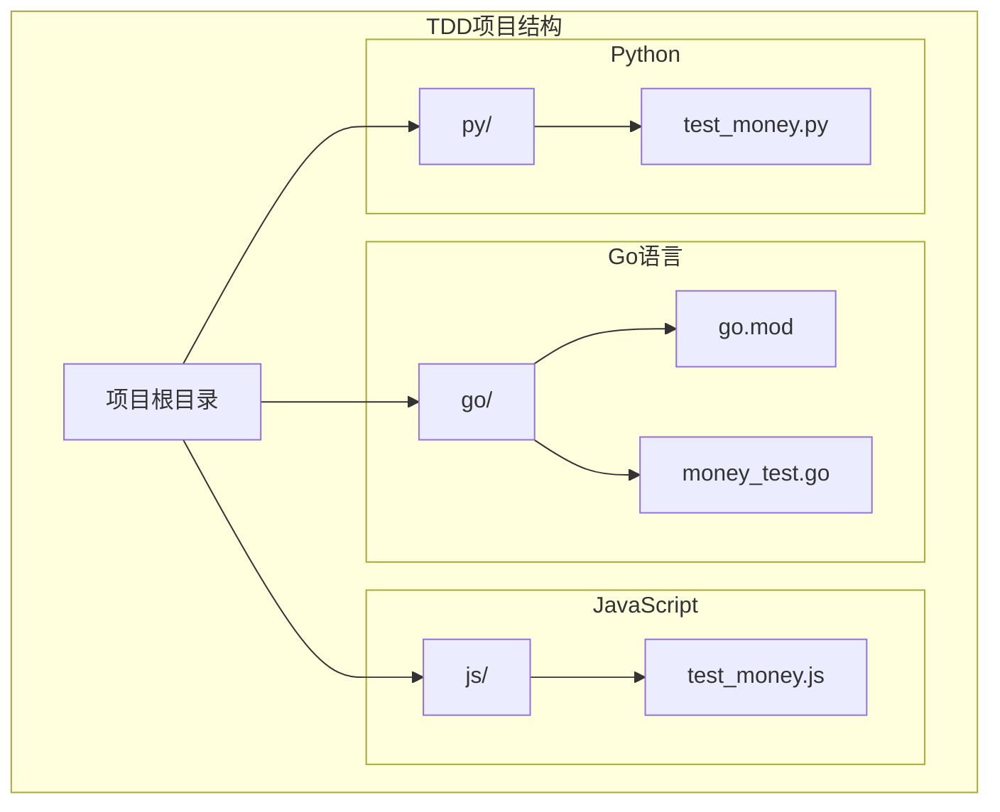
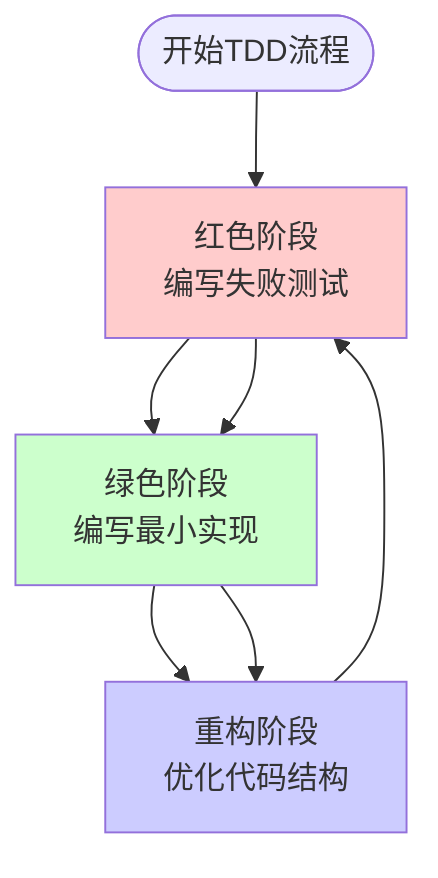
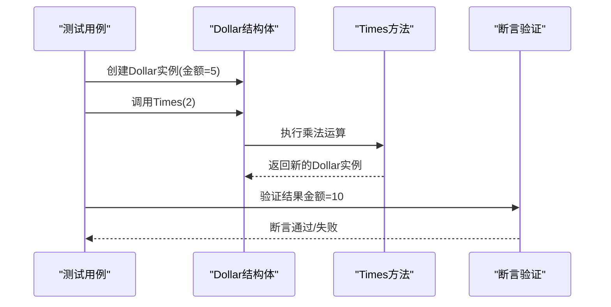
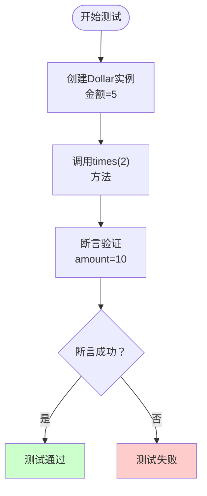
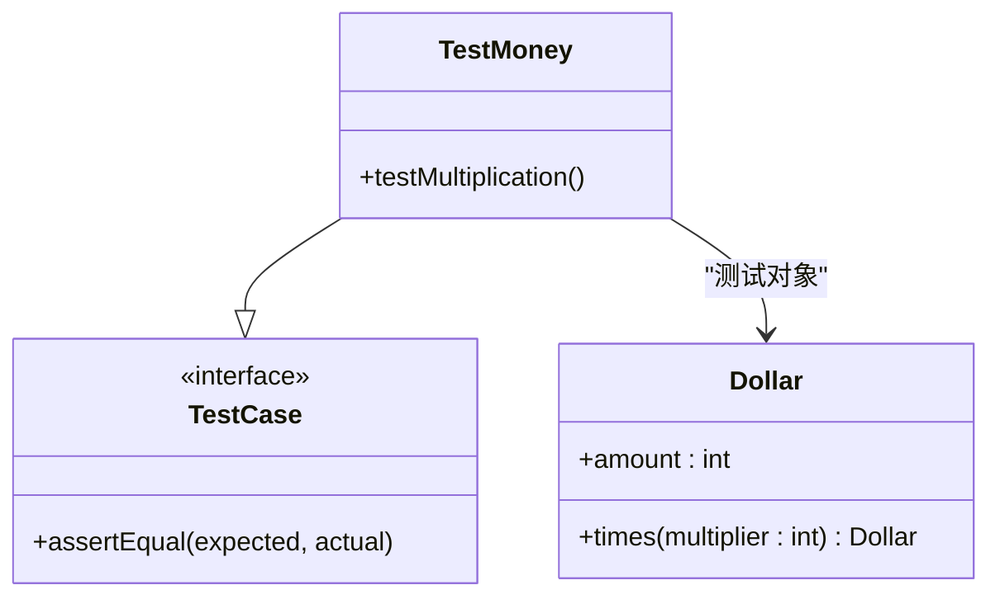
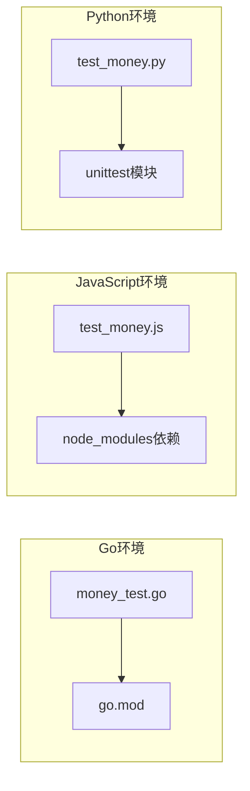

# TDD核心概念

<cite>
**本文档引用的文件**
- [go.mod](file://go/go.mod)
- [money_test.go](file://go/money_test.go)
- [test_money.js](file://js/test_money.js)
- [test_money.py](file://py/test_money.py)
</cite>

## 目录
1. [引言](#引言)
2. [项目结构](#项目结构)
3. [核心组件](#核心组件)
4. [架构概览](#架构概览)
5. [详细组件分析](#详细组件分析)
6. [依赖关系分析](#依赖关系分析)
7. [性能考虑](#性能考虑)
8. [故障排除指南](#故障排除指南)
9. [结论](#结论)
10. [附录](#附录)

## 引言

测试驱动开发（Test-Driven Development，TDD）是一种软件开发方法论，它通过先编写测试用例再编写实现代码的方式来推动软件设计和开发。这种方法强调"红-绿-重构"循环，确保代码质量、可维护性和功能正确性。

本项目展示了三种编程语言环境下的TDD实践：Go、JavaScript和Python。虽然当前仓库主要包含测试文件，但它们完美地体现了TDD的核心原则和工作流程。

## 项目结构

该项目采用多语言并行的结构设计，为每个主流编程语言提供了一个独立的测试用例文件：



**图表来源**
- [go/mod.go:1-4](file://go/go.mod#L1-L4)
- [money_test.go:1-18](file://go/money_test.go#L1-L18)
- [test_money.js:1-6](file://js/test_money.js#L1-L6)
- [test_money.py:1-11](file://py/test_money.py#L1-L11)

**章节来源**
- [go/mod.go:1-4](file://go/go.mod#L1-L4)
- [money_test.go:1-18](file://go/money_test.go#L1-L18)
- [test_money.js:1-6](file://js/test_money.js#L1-L6)
- [test_money.py:1-11](file://py/test_money.py#L1-L11)

## 核心组件

### TDD测试框架组件

本项目中的测试组件体现了TDD的核心要素：

#### 测试用例结构
每个测试文件都遵循相同的模式：
- 明确的测试目标声明
- 具体的断言验证
- 清晰的错误信息反馈

#### 多语言一致性
三种语言的测试用例保持了逻辑一致性：
- 都测试货币乘法操作
- 都验证结果的正确性
- 都使用了相同的业务场景

**章节来源**
- [money_test.go:6-14](file://go/money_test.go#L6-L14)
- [test_money.js:4-6](file://js/test_money.js#L4-L6)
- [test_money.py:5-8](file://py/test_money.py#L5-L8)

## 架构概览

TDD架构的核心是"红-绿-重构"循环，这个循环确保了代码的质量和设计的持续改进：



**图表来源**
- [money_test.go:6-14](file://go/money_test.go#L6-L14)
- [test_money.js:4-6](file://js/test_money.js#L4-L6)
- [test_money.py:5-8](file://py/test_money.py#L5-L8)

### TDD循环详解

#### 红色阶段（Red）
- 编写测试用例，预期功能尚未实现
- 测试失败，显示明确的错误信息
- 确定需要实现的功能边界

#### 绿色阶段（Green）
- 编写最简单的实现满足测试要求
- 通过所有现有测试
- 避免过度设计

#### 重构阶段（Refactor）
- 改进代码结构和设计
- 保持测试通过
- 消除重复代码

## 详细组件分析

### Go语言TDD实现

#### 测试用例分析
Go版本的测试用例展示了标准的TDD流程：



**图表来源**
- [money_test.go:6-14](file://go/money_test.go#L6-L14)

#### 结构体定义
当前的Dollar结构体定义相对简单，为后续的扩展提供了基础：

```mermaid
classDiagram
class Dollar {
+int amount
+Times(multiplier int) Dollar
}
note for Dollar : "当前仅包含基本字段<br/>方法定义待实现"
```

**图表来源**
- [money_test.go:16-18](file://go/money_test.go#L16-L18)

**章节来源**
- [money_test.go:1-18](file://go/money_test.go#L1-L18)

### JavaScript TDD实现

#### 测试用例特点
JavaScript版本的测试用例简洁明了：



**图表来源**
- [test_money.js:4-6](file://js/test_money.js#L4-L6)

**章节来源**
- [test_money.js:1-6](file://js/test_money.js#L1-L6)

### Python TDD实现

#### 单元测试框架
Python版本使用unittest框架：



**图表来源**
- [test_money.py:4-8](file://py/test_money.py#L4-L8)

**章节来源**
- [test_money.py:1-11](file://py/test_money.py#L1-L11)

## 依赖关系分析

### 语言特定依赖



**图表来源**
- [go/mod.go:1-4](file://go/go.mod#L1-L4)
- [money_test.go:1-4](file://go/money_test.go#L1-L4)
- [test_money.js](file://js/test_money.js#L2)
- [test_money.py](file://py/test_money.py#L2)

### 测试框架依赖

每种语言都有其特定的测试框架依赖：

| 语言 | 测试框架 | 版本要求 | 依赖特点 |
|------|----------|----------|----------|
| Go | testing | 标准库 | 内置测试支持 |
| JavaScript | assert | 标准库 | 内置断言工具 |
| Python | unittest | 标准库 | 内置单元测试框架 |

**章节来源**
- [go/mod.go:1-4](file://go/go.mod#L1-L4)
- [money_test.go:2-4](file://go/money_test.go#L2-L4)
- [test_money.js](file://js/test_money.js#L2)
- [test_money.py](file://py/test_money.py#L2)

## 性能考虑

### 测试执行效率

TDD测试的性能特点：

1. **快速反馈**：测试执行速度快，提供即时反馈
2. **隔离性**：每个测试独立运行，互不干扰
3. **可重复性**：测试结果稳定可靠
4. **可维护性**：测试代码简洁易懂

### 开发效率提升

TDD带来的开发效率改善：
- 减少调试时间
- 提高代码质量
- 增强代码可维护性
- 促进更好的设计决策

## 故障排除指南

### 常见问题及解决方案

#### 测试失败问题
- **症状**：测试用例无法通过
- **原因**：实现代码不符合预期
- **解决**：检查实现逻辑，确保满足测试要求

#### 类型不匹配问题
- **症状**：编译或运行时类型错误
- **原因**：数据类型不兼容
- **解决**：检查变量类型定义和转换

#### 方法未定义问题
- **症状**：调用不存在的方法
- **原因**：方法尚未实现
- **解决**：添加相应的方法实现

**章节来源**
- [money_test.go:11-13](file://go/money_test.go#L11-L13)

## 结论

本项目虽然目前只包含了测试文件，但完美地展示了TDD的核心原则和实践方法。通过Go、JavaScript和Python三种语言的对比，我们可以看到：

1. **一致性原则**：不同语言环境下保持相同的测试逻辑
2. **渐进式开发**：从简单的测试用例开始，逐步完善实现
3. **质量保证**：通过测试驱动的方式确保代码质量

TDD作为一种成熟的软件开发方法论，能够显著提高代码质量、减少bug数量，并促进更好的软件设计。通过持续的"红-绿-重构"循环，开发者可以构建更加健壮和可维护的软件系统。

## 附录

### TDD最佳实践清单

#### 编写测试的原则
- 测试应该是独立的、可重复的
- 测试应该快速执行
- 测试应该清晰表达意图
- 测试应该覆盖边界条件

#### 实现代码的指导
- 只实现满足当前测试所需的最少代码
- 避免过度设计
- 保持代码简洁明了
- 注重代码可读性

#### 重构的时机
- 当测试失败时进行重构
- 当发现重复代码时重构
- 当设计不够清晰时重构
- 重构后确保所有测试通过

### 常见误区避免

1. **测试过多或过少**：确保测试覆盖关键功能，但不过度测试
2. **忽视测试质量**：测试本身也需要良好的设计和维护
3. **过度重构**：重构应该有明确的目标和限制
4. **忽略反馈**：及时处理测试失败和代码质量问题