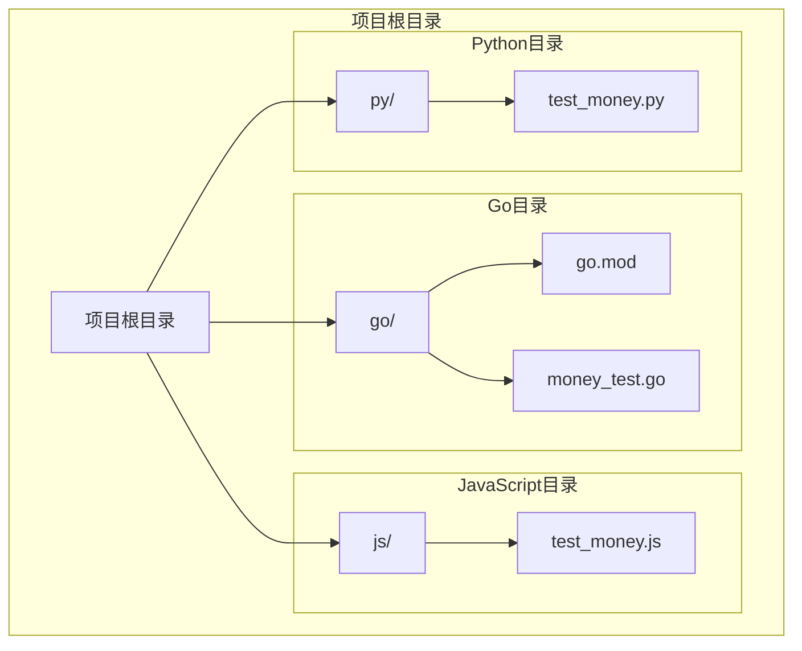
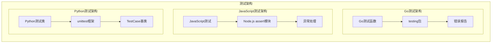
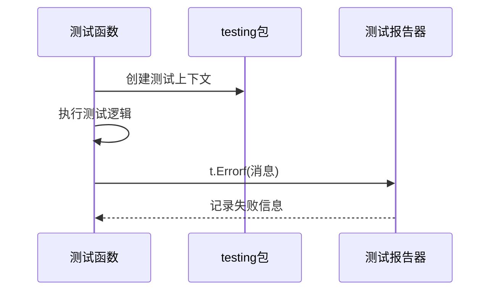
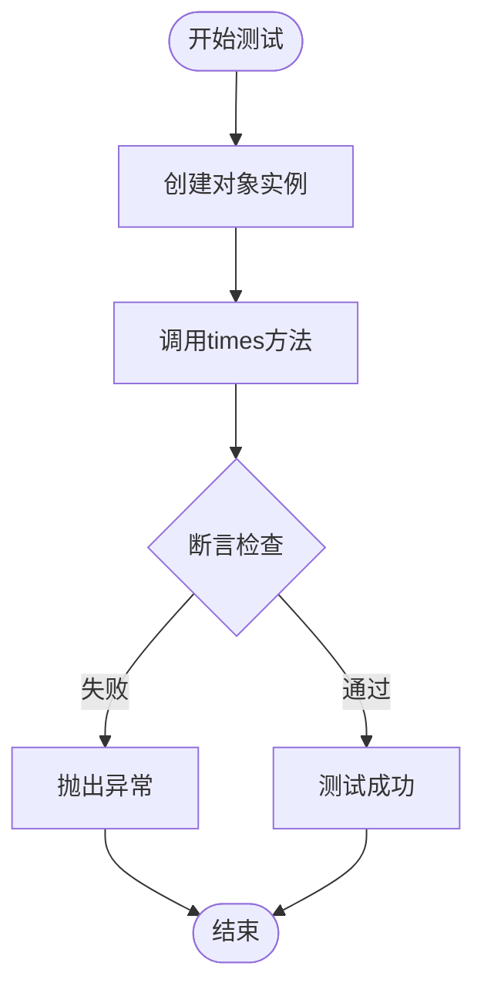
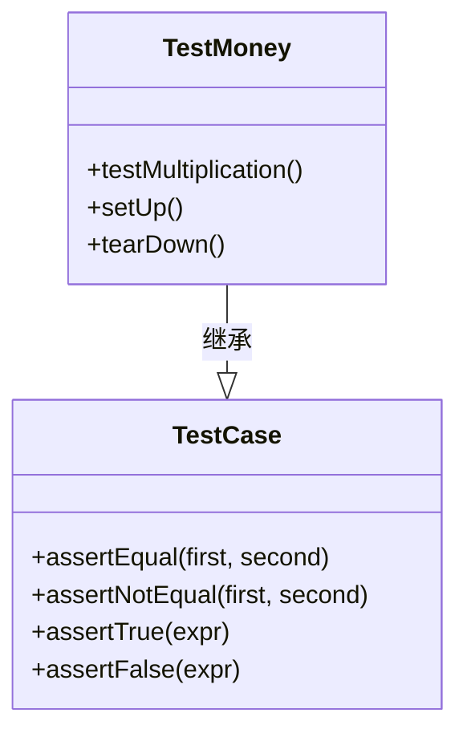
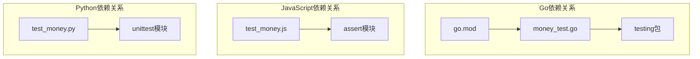

# 多语言对比分析

<cite>
**本文档引用的文件**
- [go/mod.go](file://go/go.mod)
- [go/money_test.go](file://go/money_test.go)
- [js/test_money.js](file://js/test_money.js)
- [py/test_money.py](file://py/test_money.py)
</cite>

## 目录
1. [简介](#简介)
2. [项目结构](#项目结构)
3. [核心组件](#核心组件)
4. [架构概览](#架构概览)
5. [详细组件分析](#详细组件分析)
6. [依赖关系分析](#依赖关系分析)
7. [性能考虑](#性能考虑)
8. [故障排除指南](#故障排除指南)
9. [结论](#结论)
10. [附录](#附录)

## 简介

本文件提供了对Go、JavaScript、Python三种编程语言在实现相同功能时的全面对比分析。通过分析同一测试用例在不同语言中的实现方式，深入探讨各语言的语法特点、标准库使用方式、测试框架差异和编程范式。该分析旨在帮助开发者理解不同语言的特点，为语言迁移和最佳实践提供指导。

## 项目结构

该项目采用按语言分层的组织结构，每个语言都有独立的目录和对应的测试文件：

**图表来源**
- [go/mod.go:1-4](file://go/go.mod#L1-L4)
- [go/money_test.go:1-18](file://go/money_test.go#L1-L18)
- [js/test_money.js:1-6](file://js/test_money.js#L1-L6)
- [py/test_money.py:1-11](file://py/test_money.py#L1-L11)

**章节来源**
- [go/mod.go:1-4](file://go/go.mod#L1-L4)
- [go/money_test.go:1-18](file://go/money_test.go#L1-L18)
- [js/test_money.js:1-6](file://js/test_money.js#L1-L6)
- [py/test_money.py:1-11](file://py/test_money.py#L1-L11)

## 核心组件

### 测试用例设计模式

三个语言都实现了相同的测试用例：验证货币乘法操作的正确性。测试逻辑遵循相同的步骤序列：

1. 创建初始金额对象（5美元）
2. 执行乘法操作（乘以2）
3. 验证结果（应该是10美元）

这种一致性展示了TDD（测试驱动开发）的核心理念，即先编写测试再实现功能。

### 语言特定的测试框架

| 语言 | 测试框架 | 断言方法 | 错误处理机制 |
|------|----------|----------|--------------|
| Go | testing包 | t.Errorf() | 内置测试报告器 |
| JavaScript | Node.js内置assert | assert.strictEqual() | 异常抛出 |
| Python | unittest | self.assertEqual() | 继承TestCase基类 |

**章节来源**
- [go/money_test.go:6-14](file://go/money_test.go#L6-L14)
- [js/test_money.js:2-6](file://js/test_money.js#L2-L6)
- [py/test_money.py:4-8](file://py/test_money.py#L4-L8)

## 架构概览

**图表来源**
- [go/money_test.go:2-4](file://go/money_test.go#L2-L4)
- [js/test_money.js:2](file://js/test_money.js#L2)
- [py/test_money.py:2](file://py/test_money.py#L2)

## 详细组件分析

### Go语言实现分析

#### 语法特点
Go语言展现了其简洁明了的语法风格：
- 使用`package main`声明主包
- 导入testing包进行测试
- 函数命名遵循`TestXxx`约定
- 结构体定义简洁，字段直接暴露

#### 测试框架特性
Go的testing包提供了内建的测试支持：
- 自动发现以`Test`开头的函数
- 内置的错误报告机制
- 轻量级的测试运行器

#### 错误处理机制
Go使用显式的错误报告方式：

**图表来源**
- [go/money_test.go:6-14](file://go/money_test.go#L6-L14)

**章节来源**
- [go/money_test.go:1-18](file://go/money_test.go#L1-L18)

### JavaScript实现分析

#### 语法特点
JavaScript展现了动态语言的灵活性：
- 使用require导入内置assert模块
- 基于原型的对象创建
- 简洁的函数调用语法

#### 测试框架特性
JavaScript依赖Node.js的内置assert模块：
- 提供多种断言方法
- 支持严格相等检查
- 异常作为错误处理机制

#### 错误处理机制
JavaScript通过异常机制处理测试失败：

**图表来源**
- [js/test_money.js:4-6](file://js/test_money.js#L4-L6)

**章节来源**
- [js/test_money.js:1-6](file://js/test_money.js#L1-L6)

### Python实现分析

#### 语法特点
Python展现了其强调可读性的语法风格：
- 使用unittest框架
- 类继承TestCase基类
- 方法命名遵循约定
- 使用self参数访问实例

#### 测试框架特性
Python的unittest框架提供了完整的测试基础设施：
- 面向对象的测试设计
- 内置的断言方法集合
- 测试套件组织能力

#### 错误处理机制
Python通过继承TestCase基类获得测试功能：

**图表来源**
- [py/test_money.py:4](file://py/test_money.py#L4)

**章节来源**
- [py/test_money.py:1-11](file://py/test_money.py#L1-L11)

## 依赖关系分析

**图表来源**
- [go/mod.go:1-4](file://go/go.mod#L1-L4)
- [go/money_test.go:2-4](file://go/money_test.go#L2-L4)
- [js/test_money.js:2](file://js/test_money.js#L2)
- [py/test_money.py:2](file://py/test_money.py#L2)

### 语言特性对比表

| 特性维度 | Go | JavaScript | Python |
|---------|----|------------|--------|
| **语法风格** | 静态类型，简洁明确 | 动态类型，灵活多样 | 动态类型，强调可读性 |
| **测试框架** | 内建testing包 | Node.js内置assert | unittest框架 |
| **断言方法** | t.Errorf() | assert.strictEqual() | self.assertEqual() |
| **错误处理** | 显式错误报告 | 异常抛出 | 继承TestCase基类 |
| **类型系统** | 强类型，编译时检查 | 动态类型，运行时检查 | 动态类型，鸭子类型 |
| **内存管理** | 垃圾回收 | 垃圾回收 | 垃圾回收 |
| **并发模型** | goroutines | 单线程事件循环 | 全局解释器锁(GIL) |

**章节来源**
- [go/money_test.go:1-18](file://go/money_test.go#L1-L18)
- [js/test_money.js:1-6](file://js/test_money.js#L1-L6)
- [py/test_money.py:1-11](file://py/test_money.py#L1-L11)

## 性能考虑

### 编译时vs运行时性能
- **Go**: 编译型语言，启动速度快，运行时性能优异
- **JavaScript**: 解释执行，Node.js优化后性能良好
- **Python**: 解释执行，CPython受GIL限制

### 内存使用效率
- **Go**: 静态类型，内存布局紧凑，垃圾回收器高效
- **JavaScript**: V8引擎优化，内存管理成熟
- **Python**: 动态对象，内存开销相对较大

### 并发处理能力
- **Go**: 原生goroutine支持，轻量级并发
- **JavaScript**: 单线程事件循环，异步I/O
- **Python**: GIL限制，多进程或C扩展

## 故障排除指南

### 常见问题及解决方案

#### Go语言问题
- **测试函数命名**: 必须以`Test`开头且首字母大写
- **导入包路径**: 确保正确的包导入路径
- **结构体字段**: 字段名必须首字母大写才能导出

#### JavaScript问题
- **模块导入**: 确保使用正确的require语法
- **对象实例化**: 注意构造函数的正确调用
- **断言参数顺序**: 区分期望值和实际值的顺序

#### Python问题
- **unittest.main()**: 确保在`if __name__ == '__main__':`条件下运行
- **self参数**: 测试方法必须包含self参数
- **继承关系**: 正确继承TestCase基类

**章节来源**
- [go/money_test.go:6](file://go/money_test.go#L6)
- [js/test_money.js:4](file://js/test_money.js#L4)
- [py/test_money.py:10](file://py/test_money.py#L10)

## 结论

通过对Go、JavaScript、Python三种语言在同一测试用例上的实现对比，我们可以得出以下结论：

### 语言优势总结

**Go语言优势**:
- 语法简洁，易于学习和维护
- 内建测试支持，无需额外依赖
- 编译型语言，性能优异
- 良好的并发支持

**JavaScript优势**:
- 生态系统丰富，包管理器完善
- 动态类型，开发效率高
- 事件驱动模型，适合I/O密集型应用
- 全栈开发能力

**Python优势**:
- 语法简洁，代码可读性强
- 丰富的科学计算和数据分析库
- 完善的测试框架生态系统
- 学习曲线平缓

### 适用场景建议

- **Go**: 系统编程、网络服务、并发应用、微服务架构
- **JavaScript**: Web前端开发、全栈应用、实时应用、数据可视化
- **Python**: 数据分析、机器学习、科学计算、快速原型开发

### 迁移最佳实践

1. **从Go迁移到其他语言**: 注重接口抽象和类型系统的转换
2. **从JavaScript迁移到其他语言**: 关注异步编程模型的转换
3. **从Python迁移到其他语言**: 重视面向对象设计和测试框架的适应

## 附录

### 语言特性速查表

#### Go语言特性
- 静态类型系统
- 编译型语言
- 内建并发支持
- 简洁的语法风格

#### JavaScript特性
- 动态类型系统
- 解释执行
- 事件驱动模型
- 丰富的生态系统

#### Python特性
- 动态类型系统
- 强大的标准库
- 优秀的测试框架
- 强调代码可读性

### 开发环境配置建议

#### Go环境
- Go 1.25.6或更高版本
- VS Code + Go插件
- 推荐使用Go Modules

#### JavaScript环境
- Node.js LTS版本
- npm包管理器
- ESLint代码检查

#### Python环境
- Python 3.8+版本
- pip包管理器
- pytest或unittest测试框架