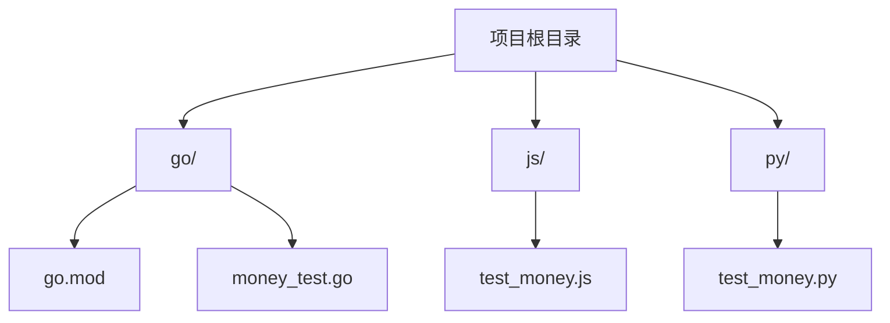
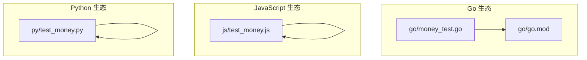
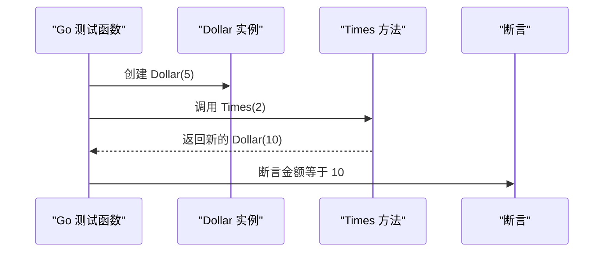
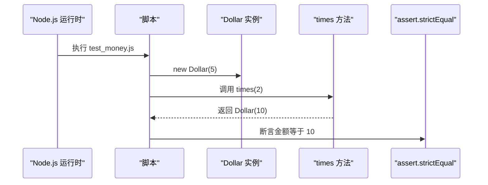
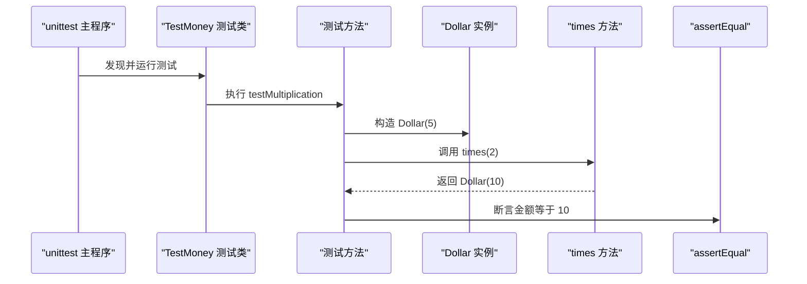
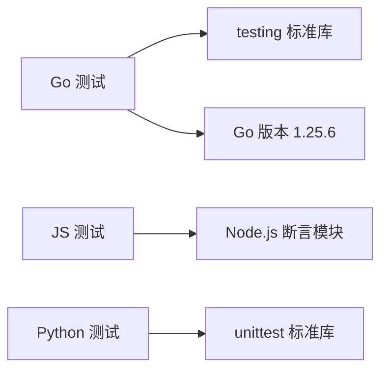

# 快速开始

<cite>
**本文引用的文件**
- [go/mod.go](file://go/go.mod)
- [go/money_test.go](file://go/money_test.go)
- [js/test_money.js](file://js/test_money.js)
- [py/test_money.py](file://py/test_money.py)
</cite>

## 目录
1. [简介](#简介)
2. [项目结构](#项目结构)
3. [核心组件](#核心组件)
4. [架构总览](#架构总览)
5. [详细组件分析](#详细组件分析)
6. [依赖分析](#依赖分析)
7. [性能考虑](#性能考虑)
8. [故障排除指南](#故障排除指南)
9. [结论](#结论)
10. [附录](#附录)

## 简介
本指南面向初学者，帮助你在最短时间内完成多语言（Go、JavaScript、Python）的环境准备、安装与测试运行。该仓库采用测试驱动开发（TDD）模式，围绕“美元乘法”这一简单需求编写了跨语言的测试用例，便于你快速理解测试先行的开发流程与各语言的测试执行方式。

## 项目结构
项目采用按语言分目录的组织方式，清晰分离不同语言的测试文件：
- go/：Go语言测试与模块配置
- js/：JavaScript测试
- py/：Python测试

图表来源
- [go/mod.go:1-4](file://go/go.mod#L1-L4)
- [go/money_test.go:1-14](file://go/money_test.go#L1-L14)
- [js/test_money.js:1-6](file://js/test_money.js#L1-L6)
- [py/test_money.py:1-11](file://py/test_money.py#L1-L11)

章节来源
- [go/mod.go:1-4](file://go/go.mod#L1-L4)
- [go/money_test.go:1-14](file://go/money_test.go#L1-L14)
- [js/test_money.js:1-6](file://js/test_money.js#L1-L6)
- [py/test_money.py:1-11](file://py/test_money.py#L1-L11)

## 核心组件
- Go测试：通过标准库 testing 包编写测试，验证 Dollar 类的乘法行为。
- JavaScript测试：使用 Node.js 内置断言模块，验证 Dollar 实例乘法结果。
- Python测试：使用 unittest 框架，定义测试类与测试方法，断言金额相等。

章节来源
- [go/money_test.go:6-14](file://go/money_test.go#L6-L14)
- [js/test_money.js:4-6](file://js/test_money.js#L4-L6)
- [py/test_money.py:4-8](file://py/test_money.py#L4-L8)

## 架构总览
本项目不包含生产代码，仅包含三个语言的测试文件，形成“测试先行”的最小可运行示例。下图展示了测试文件与其语言生态的关系：

图表来源
- [go/money_test.go:1-14](file://go/money_test.go#L1-L14)
- [go/mod.go:1-4](file://go/go.mod#L1-L4)
- [js/test_money.js:1-6](file://js/test_money.js#L1-L6)
- [py/test_money.py:1-11](file://py/test_money.py#L1-L11)

## 详细组件分析

### Go 组件分析
- 测试入口：使用 testing 包的测试函数，构造 Dollar 对象并调用 Times 方法进行乘法运算，断言结果金额。
- 模块声明：go.mod 声明模块名与 Go 版本要求（1.25.6）。

图表来源
- [go/money_test.go:6-14](file://go/money_test.go#L6-L14)

章节来源
- [go/mod.go:1-4](file://go/go.mod#L1-L4)
- [go/money_test.go:6-14](file://go/money_test.go#L6-L14)

### JavaScript 组件分析
- 测试入口：使用 Node.js 的 assert 模块，构造 Dollar 实例并调用 times 方法，断言金额相等。
- 运行方式：直接在 Node.js 环境中执行脚本即可运行测试。

图表来源
- [js/test_money.js:4-6](file://js/test_money.js#L4-L6)

章节来源
- [js/test_money.js:1-6](file://js/test_money.js#L1-L6)

### Python 组件分析
- 测试入口：使用 unittest 框架，定义测试类与测试方法，构造 Dollar 实例并调用 times 方法，断言金额相等。
- 运行方式：通过 unittest.main() 启动测试套件。

图表来源
- [py/test_money.py:4-8](file://py/test_money.py#L4-L8)

章节来源
- [py/test_money.py:1-11](file://py/test_money.py#L1-L11)

## 依赖分析
- Go 依赖：标准库 testing；模块版本要求 1.25.6。
- JavaScript 依赖：Node.js 内置断言模块。
- Python 依赖：标准库 unittest。

图表来源
- [go/mod.go:1-4](file://go/go.mod#L1-L4)
- [js/test_money.js:2](file://js/test_money.js#L2)
- [py/test_money.py:2](file://py/test_money.py#L2)

章节来源
- [go/mod.go:1-4](file://go/go.mod#L1-L4)
- [js/test_money.js:2](file://js/test_money.js#L2)
- [py/test_money.py:2](file://py/test_money.py#L2)

## 性能考虑
- 本项目为最小示例，测试规模小，性能影响可忽略。
- 在实际开发中，建议：
  - 使用语言官方推荐的测试框架与工具链。
  - 将测试拆分为更细粒度的单元测试，提升定位效率。
  - 避免在测试中引入外部依赖或网络请求。

## 故障排除指南
- Go 环境问题
  - 症状：无法识别 testing 包或 go 命令不存在
  - 排查：确认已安装 Go 1.25.6 或以上版本，并确保 GOPATH 与 PATH 正确配置
  - 参考：Go 模块声明与版本要求见 [go/mod.go:1-4](file://go/go.mod#L1-L4)
- JavaScript 环境问题
  - 症状：运行时报错找不到内置模块或 Node.js 未安装
  - 排查：确认 Node.js 已安装，且脚本路径正确
  - 参考：测试脚本入口见 [js/test_money.js:1-6](file://js/test_money.js#L1-L6)
- Python 环境问题
  - 症状：运行时报错找不到 unittest 或 Python 版本不兼容
  - 排查：确认 Python 已安装，且使用 unittest 标准库
  - 参考：测试脚本入口见 [py/test_money.py:1-11](file://py/test_money.py#L1-L11)

## 结论
本指南提供了多语言（Go、JavaScript、Python）的快速上手路径，围绕“美元乘法”测试用例展示了测试先行的开发范式。通过本项目的最小示例，你可以快速搭建各语言环境并运行测试，为进一步学习 TDD 提供基础。

## 附录

### 环境准备与安装步骤
- Go 1.25.6
  - 安装：参考官方安装指南，确保版本满足 go.mod 中的要求
  - 验证：在终端执行 go version，确认输出包含 1.25.6
  - 参考：[go/mod.go:1-4](file://go/go.mod#L1-L4)
- Node.js
  - 安装：参考官方安装指南，确保 Node.js 可用
  - 验证：在终端执行 node --version，确认 Node.js 版本可用
  - 参考：[js/test_money.js:1-6](file://js/test_money.js#L1-L6)
- Python
  - 安装：参考官方安装指南，确保 Python 可用
  - 验证：在终端执行 python --version 或 python3 --version，确认 Python 版本可用
  - 参考：[py/test_money.py:1-11](file://py/test_money.py#L1-L11)

### 运行测试步骤
- Go
  - 进入 go 目录，执行测试命令以运行 Go 测试
  - 参考：[go/money_test.go:6-14](file://go/money_test.go#L6-L14)
- JavaScript
  - 进入 js 目录，执行 Node.js 脚本以运行测试
  - 参考：[js/test_money.js:1-6](file://js/test_money.js#L1-L6)
- Python
  - 进入 py 目录，执行 Python 脚本以运行测试
  - 参考：[py/test_money.py:1-11](file://py/test_money.py#L1-L11)