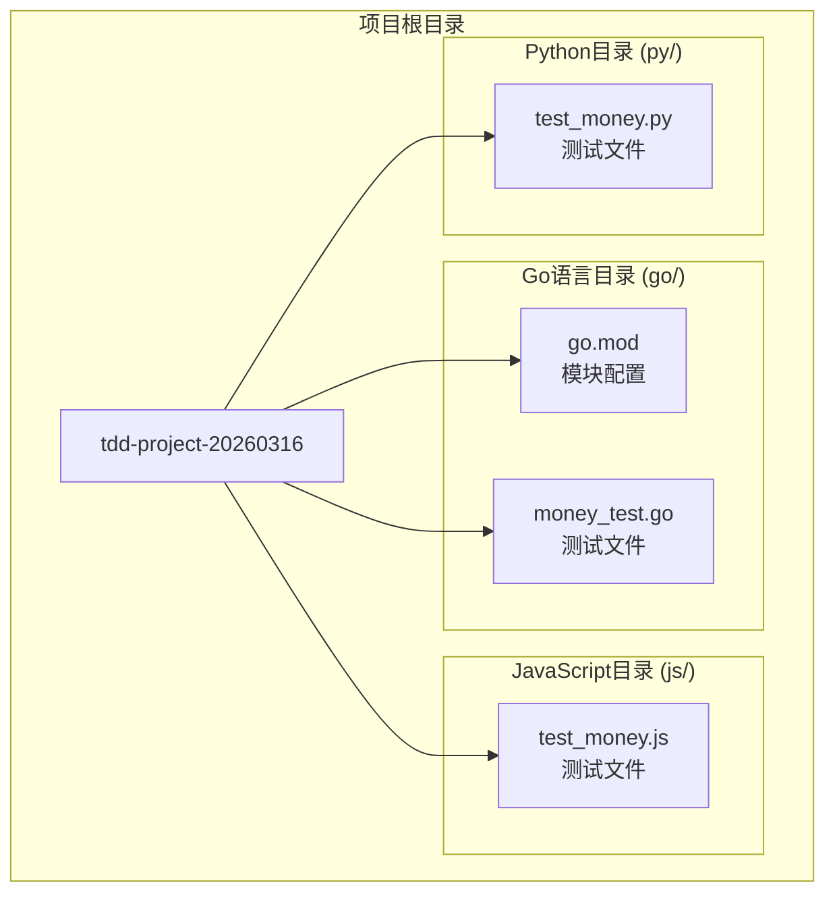
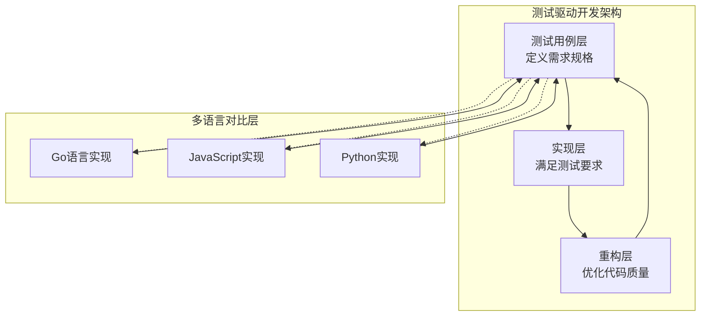
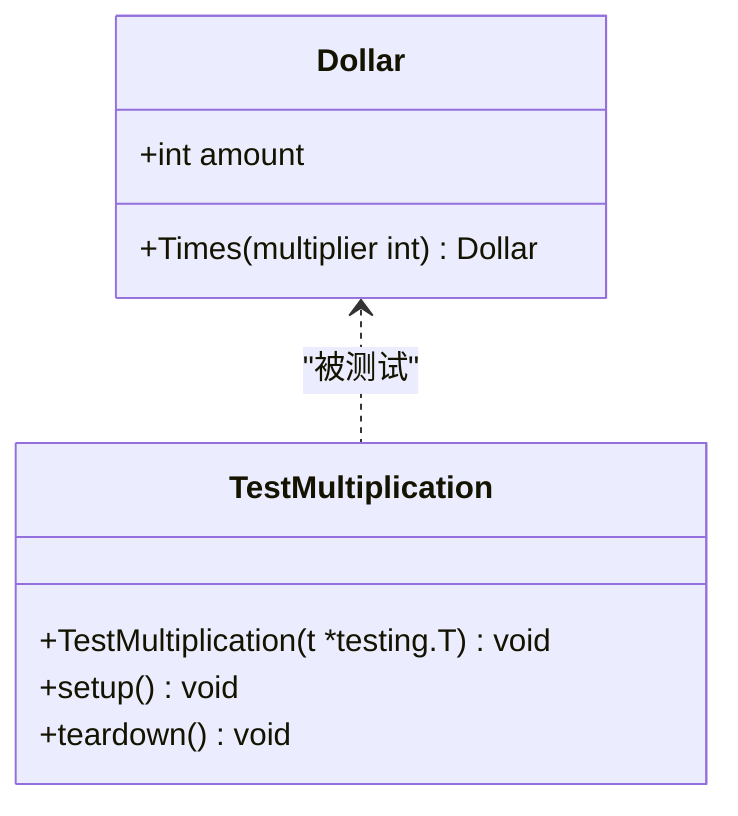
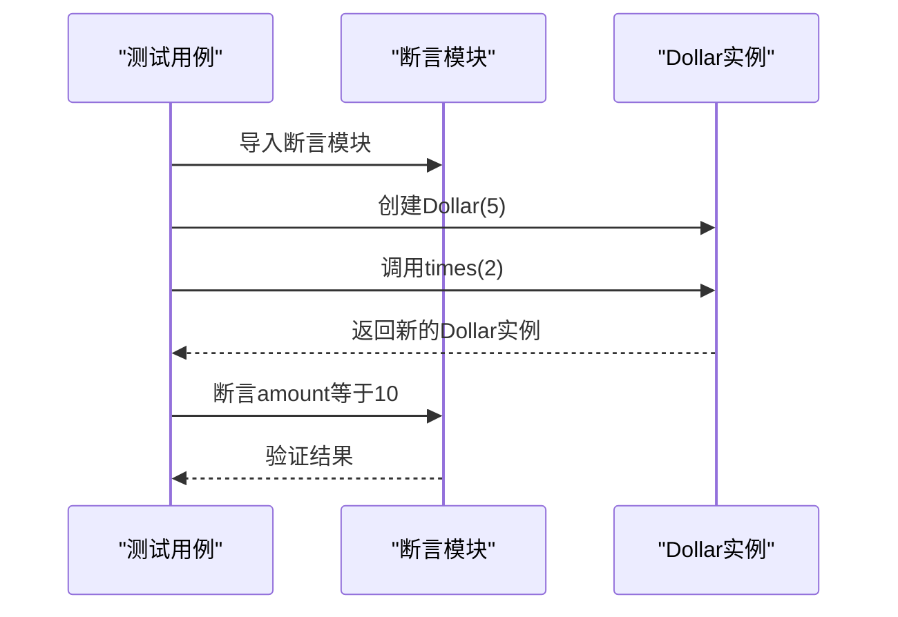
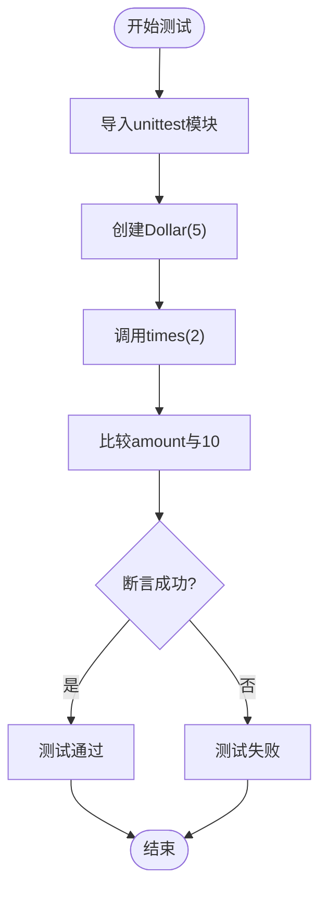
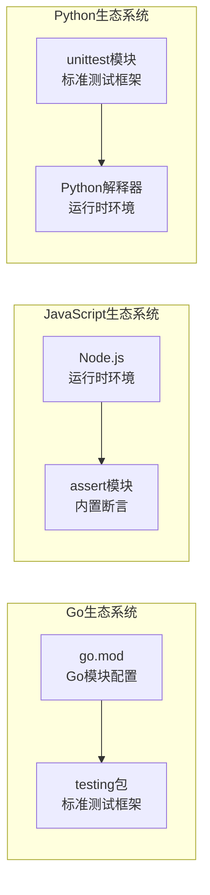

# 项目概述

<cite>
**本文档中引用的文件**
- [go/money_test.go](file://go/money_test.go)
- [js/test_money.js](file://js/test_money.js)
- [py/test_money.py](file://py/test_money.py)
- [go/go.mod](file://go/go.mod)
</cite>

## 目录
1. [引言](#引言)
2. [项目结构](#项目结构)
3. [核心组件](#核心组件)
4. [架构概览](#架构概览)
5. [详细组件分析](#详细组件分析)
6. [依赖分析](#依赖分析)
7. [性能考虑](#性能考虑)
8. [故障排除指南](#故障排除指南)
9. [结论](#结论)

## 引言

本项目是一个精心设计的TDD（测试驱动开发）多语言练习项目，旨在通过对比Go、JavaScript、Python三种主流编程语言来演示相同的测试用例实现。该项目的核心教育价值在于：

- **TDD理念实践**：通过实际的测试驱动开发流程，让学习者深入理解测试先行的编程思想
- **多语言对比学习**：在同一业务场景下对比不同语言的语法特点、测试框架差异和编程范式
- **渐进式学习路径**：从简单的乘法操作开始，逐步构建复杂的货币处理系统
- **最佳实践展示**：展示如何在不同语言环境中编写高质量、可维护的测试代码

## 项目结构

该项目采用简洁明了的分层组织结构，每个编程语言都有独立的目录，便于学习者专注于特定语言的实现细节：

**图表来源**
- [go/money_test.go:1-14](file://go/money_test.go#L1-L14)
- [js/test_money.js:1-6](file://js/test_money.js#L1-L6)
- [py/test_money.py:1-11](file://py/test_money.py#L1-L11)

**章节来源**
- [go/go.mod:1-4](file://go/go.mod#L1-L4)
- [go/money_test.go:1-14](file://go/money_test.go#L1-L14)
- [js/test_money.js:1-6](file://js/test_money.js#L1-L6)
- [py/test_money.py:1-11](file://py/test_money.py#L1-L11)

## 核心组件

### 测试用例设计

三个语言版本都实现了相同的测试用例，验证货币金额的乘法运算功能：

#### Go语言实现
- 使用标准测试包进行单元测试
- 采用结构体作为数据容器
- 展示Go语言的类型安全和错误处理机制

#### JavaScript实现  
- 使用Node.js的内置断言模块
- 采用面向对象的构造函数模式
- 展示动态类型的灵活性

#### Python实现
- 基于unittest框架的标准测试类
- 使用面向对象的测试方法
- 展示Python的简洁语法和测试组织方式

**章节来源**
- [go/money_test.go:6-14](file://go/money_test.go#L6-L14)
- [js/test_money.js:4-6](file://js/test_money.js#L4-L6)
- [py/test_money.py:4-8](file://py/test_money.py#L4-L8)

## 架构概览

该项目采用极简的单层架构设计，专注于测试驱动开发的学习目标：

**图表来源**
- [go/money_test.go:6-14](file://go/money_test.go#L6-L14)
- [js/test_money.js:4-6](file://js/test_money.js#L4-L6)
- [py/test_money.py:4-8](file://py/test_money.py#L4-L8)

该架构体现了TDD的核心循环：先编写失败的测试，然后编写最小量的实现代码使其通过，最后进行重构优化。

## 详细组件分析

### Go语言组件分析

Go语言版本展示了现代静态类型语言在TDD中的应用特点：

**图表来源**
- [go/money_test.go:6-14](file://go/money_test.go#L6-L14)

Go语言实现的关键特征：
- **类型安全**：明确的类型声明确保编译时错误检测
- **简洁语法**：最少的样板代码，专注于核心逻辑
- **标准测试包**：集成的testing包提供完整的测试基础设施

### JavaScript组件分析

JavaScript版本体现了动态语言在TDD中的优势：

**图表来源**
- [js/test_money.js:1-6](file://js/test_money.js#L1-L6)

JavaScript实现的特点：
- **动态类型**：运行时类型检查，更灵活的开发体验
- **模块化**：ES6模块系统支持清晰的代码组织
- **轻量级**：无需复杂的构建工具即可运行测试

### Python组件分析

Python版本展示了脚本语言在测试驱动开发中的优雅性：

**图表来源**
- [py/test_money.py:4-8](file://py/test_money.py#L4-L8)

Python实现的优势：
- **可读性强**：接近自然语言的语法结构
- **测试框架成熟**：unittest提供丰富的断言方法
- **社区生态**：广泛的第三方测试工具支持

**章节来源**
- [go/money_test.go:1-14](file://go/money_test.go#L1-L14)
- [js/test_money.js:1-6](file://js/test_money.js#L1-L6)
- [py/test_money.py:1-11](file://py/test_money.py#L1-L11)

## 依赖分析

项目采用最小化依赖策略，每个语言版本都使用各自生态系统中的标准工具：

**图表来源**
- [go/go.mod:1-4](file://go/go.mod#L1-L4)
- [go/money_test.go:2-4](file://go/money_test.go#L2-L4)
- [js/test_money.js:2](file://js/test_money.js#L2)](file://js/test_money.js#L2)

这种依赖策略的优势：
- **零外部依赖**：减少学习复杂度，专注于核心概念
- **语言原生特性**：充分利用各语言的内置功能
- **易于部署**：不需要复杂的构建或安装过程

**章节来源**
- [go/go.mod:1-4](file://go/go.mod#L1-L4)
- [go/money_test.go:2-4](file://go/money_test.go#L2-L4)
- [js/test_money.js:2](file://js/test_money.js#L2)

## 性能考虑

由于项目规模较小，性能不是主要关注点，但可以从以下几个方面进行考量：

- **测试执行效率**：三个语言版本的测试都极其简单，执行时间可以忽略不计
- **内存使用**：仅创建少量对象，内存占用极少
- **启动开销**：各语言的测试框架启动时间都很短
- **扩展性**：当前架构易于添加更多测试用例和功能

## 故障排除指南

### 常见问题及解决方案

#### Go语言测试问题
- **问题**：找不到testing包
- **解决方案**：确认Go版本兼容性和正确的包导入路径

#### JavaScript测试问题  
- **问题**：无法找到Dollar构造函数
- **解决方案**：检查Node.js环境和模块导入语句

#### Python测试问题
- **问题**：unittest模块导入失败
- **解决方案**：确认Python版本和unittest模块可用性

**章节来源**
- [go/money_test.go:1-14](file://go/money_test.go#L1-L14)
- [js/test_money.js:1-6](file://js/test_money.js#L1-L6)
- [py/test_money.py:1-11](file://py/test_money.py#L1-L11)

## 结论

本TDD多语言练习项目通过简洁而有效的设计，成功地实现了以下教育目标：

1. **TDD理念传播**：通过实际的测试驱动开发流程，让学习者理解测试先行的重要性
2. **多语言对比**：在同一业务场景下展示不同编程语言的实现差异和特点
3. **最佳实践示范**：展示如何在不同语言环境中编写高质量的测试代码
4. **学习路径优化**：提供从简单到复杂的渐进式学习体验

该项目的价值在于其简洁性和教育性，为初学者提供了清晰的学习路径，同时为有经验的开发者提供了对比不同语言实现的机会。通过这种多语言的对比学习，学习者能够更深入地理解编程语言的本质差异和共同的设计原则。